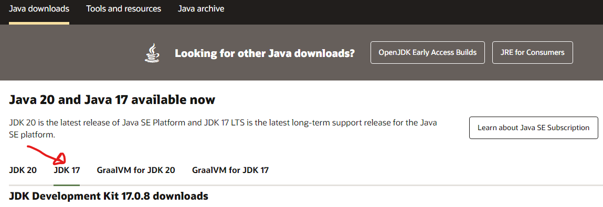
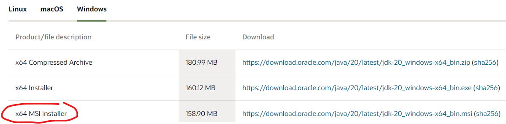
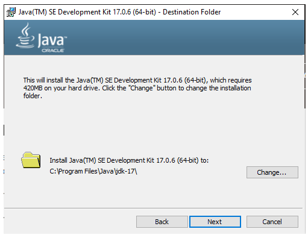
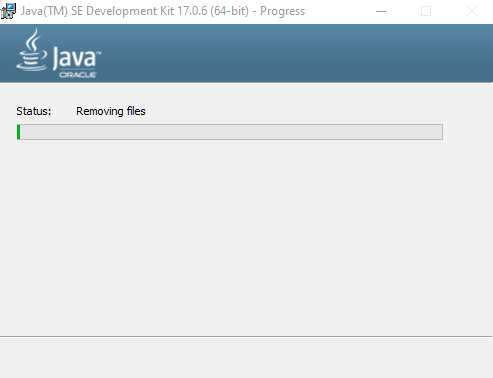
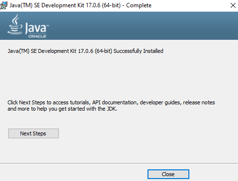
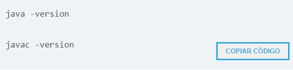
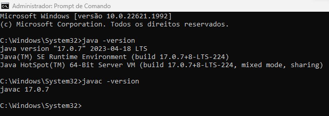

<h1 align="center"> Curso fundamentos JAVA. </h1>

>AULA-01

**Preparando as ferramentas para o ambiente**

Para dar inicio precisamos, para poder trabalhar com Java?
* kit de desenvolvimento, disponivel neste link [site oficial da Oracle](https://www.oracle.com/br/java/technologies/downloads/) na seção de download do Java.
 

Nessa página, apareceu a versão 20 e a versão 17 do Java. Vamos optar por versões que terão suporte a longo prazo, são as famosas versões LTS (Long-term support).

Vamos selecionar o Java 17. Em seguida, ele dá as opções de sistema operacional, eu estou usando o Windows aqui. Vou selecionar "Windows" e clicar no link da opção "x64 MSI Installer".

* Após baixado, vamos executar o instalador e prosseguir com a instalação.

* Após a instalação, vamos testar o nosso Java. Para isso, utilizaremos o prompt de comando. Teste os seguintes comandos e verifique se tudo correu como o esperado:

Resultado:

Agora precisaremos do ambiente de desenvolvimento, para termos uma ferramenta que nos auxilie e possamos nos concentrarmos na regra de negócio, na lógica do negócio, no que de fato precisamos trabalhar.

* Disponivel neste link [site oficial IntelliJ](https://www.jetbrains.com/idea/download/?section=windows) veremos que existem duas versões, a Ultimate, que é uma versão paga e tem mais recursos, e a versão Community Edition, que é uma versão que nos atenderá muito bem e é uma versão gratuita.

